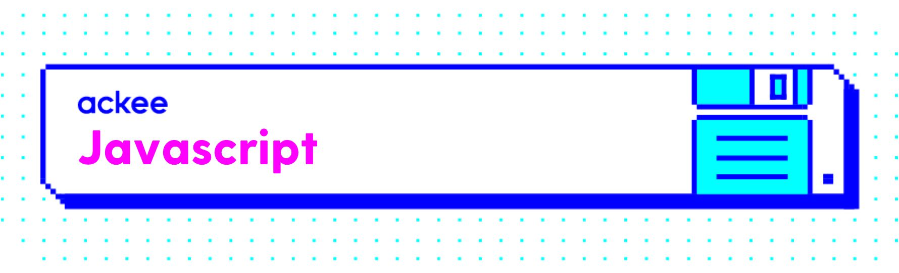

# Ackee Cookbook Web Version

Welcome, stranger! 👨🏻‍💻 
Wanna join us at [Ackee][1]? Or you just don't know what to do on a lazy sunday afternoon ? 🌤 💤

We have a tasty Task for you! Create a Typescript version of our delicious Ackee recipes. We have everything you need to get you started
- API (and a running server)
- Designs
- You can use our old grandpa stack => Simple React + Redux + Webpack skeleton with all assets (deprecated) ⛔️
- But we highly recommend to use official Next.js skeleton - https://github.com/AckeeCZ/next-app-template or our previous SPA create-react-app skeleton from facebook - https://facebook.github.io/create-react-app/docs/getting-started 🙏🏻
- We don't have the designs specific for monitors (we have mobile design only) but I am sure you can handle it by yourself and suprise us with some extra media queries 🖥
- You can look see our libraries and stuff we use at our doc pages - https://frontend-cookbook.ack.ee/#/ 🔥

## API & Server
Documentation for the api can be found on [Apiary][2] and the
fake api server runs lives here [Fake Api][3]
You can use both the Apiary or the Fake Api as well - its up to you!
The data are not persistent between calls (so dont worry that the POST calls are not stored there) :) 
Api could be sometimes tricky but I know you can handle it! 🏆

## Designs
Application should contain these 3 screens. You can also download a Sketch app file over [here][4]

&nbsp;&nbsp;&nbsp;
&nbsp;
&nbsp;&nbsp;&nbsp;

- List of recipes
- Form to add a new recipe (via the plus button)
- Detail of a recipe with rating (on a list item click)

## Tasks for you

We slightly recommend you to use our React + Redux + Webpack skeleton but you can use whatever framework you want. **The result should be a frontend app running in a browser.**

- Write the app.
- Use JavaScript to access API and to modify DOM.
- Use mobile first CSS approach to create a look of the app.
- The app should run in common browsers (i.e. you don't have to support IE10 and lower).
- The user should be able to rate a recipe only once (user = browser).
- If you want to add anything extra, just go for it!
- Send it to us as link to dropbox / GDrive / etc..

[1]:	https://ackee.cz
[2]:	http://docs.cookbook3.apiary.io/#introduction/recipes
[3]:	https://github.com/AckeeCZ/web-task-cookbook-fake-api
[4]:	https://raw.githubusercontent.com/AckeeCZ/cookbook-android-task/master/screens/ackee_cookbook.sketch
[5]:	https://github.com/AckeeCZ/android-cookbook
